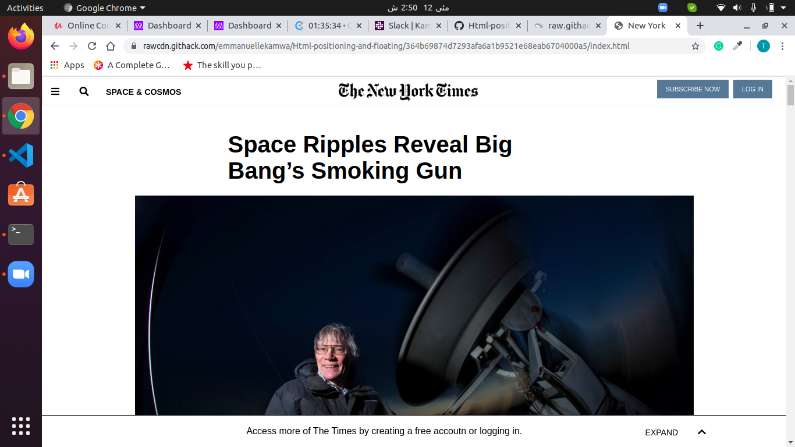

# html-forms-
Microverse HTML Forms Project Visvaldas-and-Talha

The page tries to replicate as much as possible the actual New York Times article page.

## Built With

- Html,
- CSS

## Live Demo

[Live Demo Link](https://raw.githack.com/emmanuellekamwa/Html-positioning-and-floating/feature-html/index.html)

## Authors

👤 **Author1**

- Github: [@emmanuellekamwa](https://github.com/emmanuellekamwa)
- Twitter: [@AlixKamwa](https://twitter.com/AlixKamwa)
- Linkedin: [emmanuelle-kamwa-86145a1a4](https://www.linkedin.com/in/emmanuelle-kamwa-86145a1a4/)
- email: (emmanuellekamwa@gmail.com)

👤 **Author2**

- Github: [@talhawaqar](https://github.com/talhawaqar)
- Linkedin: [@talha-waqar](https://www.linkedin.com/in/talha-waqar-977257145/)
- Twitter: [@MuhammadTalhaW4](https://twitter.com/MuhammadTalhaW4)
- email: (talhawaqar007@hotmail.com)
- email-2: (talhawaqar007@gmail.com)

## 🤝 Contributing

Contributions, issues and feature requests are welcome! Start by:

- Forking the project
- Cloning the project to your local machine
- `cd` into the Youtube-Replica project directory
- Run `git checkout -b your-branch-name`
- Make your contributions
- Push your branch up to your forked repository
- Open a Pull Request with a detailed description to the development branch of the original project for a review

## 📝 License

This project is [MIT](https://opensource.org/licenses/MIT) licensed.
